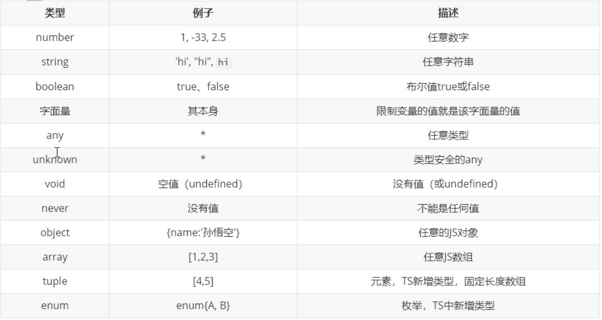

# 03_TS中类型（1）

|本期版本|上期版本
|:---:|:---:
`Sat Jul  1 14:28:06 CST 2023` | 



**字面量**

> [Union Types](https://www.typescriptlang.org/docs/handbook/2/everyday-types.html#union-types)

```typescript
let b: "male" | "female"
```


**any**

* 显示: 表示的是任意类型，一个变量设置类型为 any 之后相当于对该变量关闭了TS的类型检测
* 隐式: 声明变量如果不指定类型，则TS解析会自动判断类型变量的类型为 any
* any 类型的变量可以赋值给任意变量


**unknown**


* unknown 类型的变量，不能直接赋值给其他变量

```typescript
let s:string
let e:unknown
```

> [Narrowing](https://www.typescriptlang.org/docs/handbook/2/narrowing.html), 类型保护

```typescript
if(typeof e === "string"){
	s = e
}

```

> [Type Assertions](https://www.typescriptlang.org/docs/handbook/2/everyday-types.html#type-assertions)， 类型断言(告诉编译器变量的实际类型)

```typescript
s = e as string
s = <string>e
```


**never**

> [never](https://www.typescriptlang.org/docs/handbook/2/functions.html#never)

* 永远不会返回结果

```typescript
function fn2(): never{
	throw new Error('报错了!');
}
```
